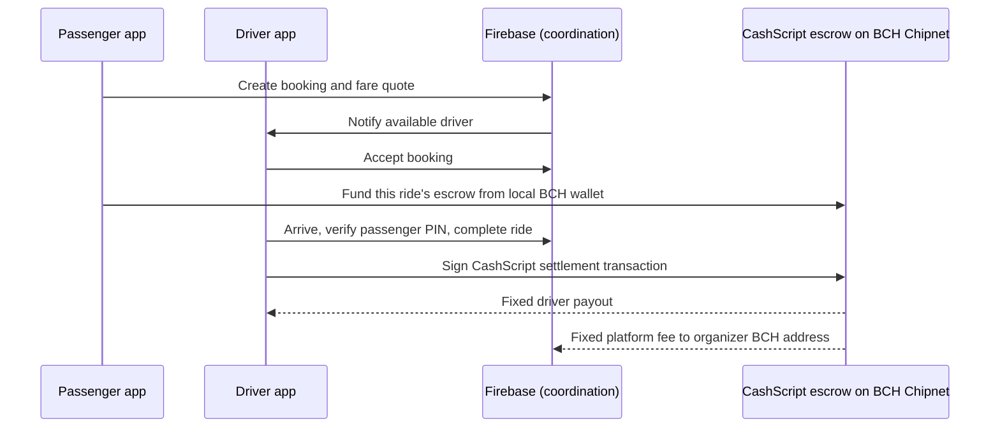

# PASADA

**A tricycle booking system for Ormoc City with transparent Bitcoin Cash (BCH) fare escrow.**

PASADA helps passengers request a tricycle, lets registered drivers accept nearby requests, and holds a BCH fare in a ride-specific CashScript contract until the ride is completed or refunded. It is a working web-app prototype built for Chipnet, the BCH test network.

**Presentation:** [View the PASADA slides](https://pasada-slides.figma.site/)

## Pre-judging summary

| Question | PASADA's answer |
| --- | --- |
| What problem does it solve? | It makes tricycle booking, pricing, live ride coordination, and payment records easier to understand for passengers, drivers, and organizers. |
| What makes it different? | The fare is locked in a ride-specific BCH smart contract; neither PASADA nor Firebase can redirect its payout. |
| Who uses it? | Passengers request rides, drivers accept and complete them, and organizers manage fare rules and review activity. |
| Is it real blockchain integration? | Yes. The app creates, funds, refunds, and settles CashScript UTXOs on BCH Chipnet, with transactions viewable in the Chipnet BCH Explorer. |
| Is it production money today? | No. This version uses Chipnet test BCH. It is a prototype; mainnet deployment needs security review, operational monitoring, and user key-recovery design. |

## What reviewers can see

- Passenger and driver sign-up, role-based access, and browser-local BCH wallets.
- Passenger booking with named pickup/destination locations and an automatic **four-seat minimum buyout**. A declared group of five or six is billed for that many seats.
- Real-time driver dispatch, acceptance, driver approach, PIN verification, ride progress, in-ride chat, and post-ride activity history.
- BCH escrow funding after the driver accepts, then an on-chain fixed split to the driver and PASADA when the driver completes the ride.
- Clear cancellation/refund state, transaction links, and a public on-chain timeout-refund path.
- Organizer controls for fare configuration, platform fee wallet, activity review, and operational visibility.

## The booking and payment flow



### Booking states

1. **Searching** — Passenger creates a request. It closes after one minute if no driver accepts.
2. **Funding** — When a driver accepts, the passenger's browser funds that ride's unique CashScript address. If no payment is completed within two minutes, the driver is released and the booking cancels.
3. **Accepted / arriving / PIN verification** — The apps share live status, location, and an in-ride chat. The passenger gives the one-time PIN to begin the ride.
4. **In transit** — The passenger sees estimated progress. GPS updates improve the progress measurement; an estimated fallback prevents the indicator from remaining static between location updates.
5. **Settled or refunded** — The driver completes the on-chain payout after the ride, or the passenger receives a refund. Both users can open the transaction from Activity.

## Why CashScript matters here

Firebase coordinates the booking experience; it does **not** control the BCH funds. The fare is sent to a CashScript contract address that is constructed from the passenger, driver, platform addresses, fixed payout amounts, and refund deadline for that specific ride.

The contract has three paths:

| Path | Who can trigger it | What the contract enforces |
| --- | --- | --- |
| `settle` | Driver signature | Exactly two outputs: the precomputed driver payout and the precomputed PASADA platform fee. |
| `refund` | Passenger signature | A single output returning the escrow amount (less the fixed network-fee reserve) to the passenger address. |
| `timeoutRefund` | Anyone after the deadline | A single, locked output to the passenger address. It needs no private key and cannot pay a third party. |

The contract never accepts a transaction that changes these destination addresses or amounts. This means a database write, compromised organizer account, or altered UI cannot make the escrow pay an arbitrary wallet.

Read the technical implementation and judge Q&A in [docs/CASHSCRIPT-INTEGRATION.md](docs/CASHSCRIPT-INTEGRATION.md). The contract source is [contracts/PasadaEscrow.cash](contracts/PasadaEscrow.cash).

## Privacy and security approach

- The passenger and driver BCH signing keys stay in the browser that created or linked the wallet; the app stores their public address and public key in Firebase, never their WIF/private key.
- Before contract creation, PASADA verifies that each published public key matches the displayed BCH address.
- Contract funding, settlement, and refund transactions are constructed and signed in the relevant user's browser, then broadcast to BCH Chipnet through Electrum providers.
- Transaction IDs are shown in the activity record and link to [Chipnet BCH Explorer](https://chipnet.bch.ninja/).
- Ride chat is available only during a live booking or trip and is archived after the ride closes.

### Important prototype boundaries

- This prototype uses **Chipnet test BCH**, not real money.
- CashScript enforces financial transaction rules, but it cannot prove that a physical ride happened. The current app workflow calls settlement when the driver marks arrival; a production service should add dispute handling, driver accountability, and stronger trip evidence.
- BCH contracts are passive: `timeoutRefund` becomes valid at the deadline but must still be broadcast by a client or a scheduled backend worker. The app checks timeouts while an app is open; production deployment should add that scheduled worker.
- Browser local storage is suitable for a hackathon prototype, but a production app needs a hardened wallet/key-recovery model and a professional security review.

## Recommended pre-judging demo

1. Start the three local app windows described in [Running the three roles locally](#running-the-three-roles-locally). Use separate browser profiles or incognito windows so the Passenger, Driver, and Admin sessions do not overwrite each other.
2. Create a fresh passenger account. The reviewer must fund **their own newly created passenger Chipnet wallet** with test BCH before requesting a blockchain ride. PASADA does not provide a shared or pre-funded wallet. Copy the `bchtest:` address from the Passenger wallet, get Chipnet test BCH from a faucet such as [Paytaca's Chipnet Faucet](https://faucet.paytaca.com/), then use **Sync wallet** to confirm the balance.
3. Create or sign in to a driver account, then switch the driver online. The driver and organizer accounts do not need BCH to accept a booking; the passenger provides the escrow amount.
4. As passenger, select a named pickup and destination, choose passenger count, and request a ride.
5. Accept the request as the driver. Explain that the passenger wallet now funds the contract address, not the driver's address.
6. Show the funding transaction and the live passenger status. Arrive, verify the PIN, then start the ride.
7. Show the passenger progress indicator and in-ride chat. Complete the ride as the driver.
8. Open Activity in either role, then open the settlement transaction in the Chipnet BCH Explorer.

The **Live Ormoc demo** is only a scripted UI walkthrough. It does not replace the funded-wallet flow above and does not create a reviewer-owned BCH transaction.

## Architecture

```text
React + TypeScript mobile web apps
        |
        +-- Firebase Authentication: role sign-in
        +-- Firebase Realtime Database: dispatch, ride state, chat, activity indexes
        |
        +-- Browser-local BCH wallet: key creation and transaction signatures
        +-- CashScript + Electrum: ride escrow UTXO, payout, refund, timeout recovery
        +-- Chipnet BCH Explorer: public transaction verification
```

## Local setup

```bash
npm install
copy .env.example .env
npm run dev
```

Set the Firebase values in `.env`, then open the Vite URL shown in the terminal. Compile the CashScript artifact and production bundle with:

```bash
npm run build
```

The build runs `npm run contracts:build` first, compiling `contracts/PasadaEscrow.cash` into `src/contracts/PasadaEscrow.json`.

## Running the three roles locally

Run three development servers in three PowerShell terminals. They share the same Firebase project from the same `.env` file, so a booking created in the Passenger window appears in the Driver window.

```powershell
# Terminal 1 — Passenger / Rider
$env:PORT=8443; npm run dev

# Terminal 2 — Driver
$env:PORT=8444; npm run dev

# Terminal 3 — Admin / Organizer
$env:PORT=8445; npm run dev
```

Open the roles in separate browser profiles or incognito windows:

| Role | Local URL | Select in the app |
| --- | --- | --- |
| Passenger / Rider | `http://localhost:8443` | **Passenger** |
| Driver | `http://localhost:8444` | **Driver** |
| Admin / Organizer | `http://localhost:8445` | **Admin** |

All three local apps use the same real-time database. Keep the passenger and driver windows open during the ride so live status, route progress, and chat updates are visible.

## Project map

```text
contracts/PasadaEscrow.cash          CashScript contract source
scripts/compile-contracts.mjs        CashScript artifact compiler
src/lib/bch-escrow.ts                Contract construction, funding, settlement, refunds
src/lib/ride-service.ts              Booking states, dispatch, timeout reconciliation
src/apps/passenger/PassengerApp.tsx  Passenger booking and ride experience
src/apps/driver/DriverApp.tsx        Driver dispatch and completion experience
src/apps/admin/AdminApp.tsx          Organizer fare and activity console
docs/CASHSCRIPT-INTEGRATION.md       Technical guide and judge Q&A
```

## Technology

React 19, TypeScript, Vite, Tailwind CSS, Firebase Authentication, Firebase Realtime Database, CashScript 0.13, `@bitauth/libauth`, and Electrum Cash network providers.
