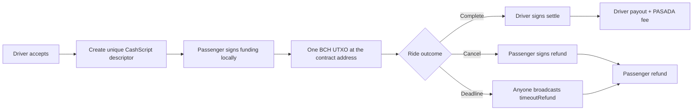

# CashScript integration in PASADA

This is the technical companion to the [judge guide](../README.md). It explains which parts of PASADA are enforced by BCH CashScript and which parts are coordinated by the web application.

## Reviewer quick start

1. Run three instances of the app on `localhost:8443`, `localhost:8444`, and `localhost:8445` for Passenger, Driver, and Admin respectively. See [Running the three roles locally](../README.md#running-the-three-roles-locally).
2. Give the **passenger's newly created `bchtest:` wallet** Chipnet test BCH from a faucet. PASADA does not supply or share a pre-funded wallet; the reviewer funds the wallet they use for the blockchain demonstration.
3. Keep the Passenger and Driver windows open in separate browser profiles while completing the ride. They share the same Firebase project and therefore receive the same live booking state.
4. After settlement or refund, use the activity link to inspect the transaction in [Chipnet BCH Explorer](https://chipnet.bch.ninja/).

## What CashScript does

For every BCH booking, PASADA creates one `PasadaEscrow` contract with immutable parameters:

```text
passenger public key and P2PKH hash
driver public key and P2PKH hash
PASADA platform P2PKH hash
driver payout in satoshis
platform fee in satoshis
fixed BCH network-fee reserve
refund deadline (Unix timestamp)
```

The parameters produce a deterministic contract address. Before funding, PASADA reconstructs the contract and checks that its calculated address matches the saved address. It also validates that each public key corresponds to the BCH address displayed in the app.

The contract source is [`contracts/PasadaEscrow.cash`](../contracts/PasadaEscrow.cash); `npm run contracts:build` compiles it into the JSON artifact consumed by the browser app.

## Three ways the escrow can be spent

| Contract function | Trigger | Enforced result |
| --- | --- | --- |
| `settle(sig driverSignature)` | The driver signs after completing the ride. | Exactly two outputs: the preset driver payout and preset PASADA fee. |
| `refund(sig passengerSignature)` | The passenger cancels before pickup. | One output returning escrow funds, less the fixed fee reserve, to the passenger address. |
| `timeoutRefund()` | Anyone broadcasts it after `refundLocktime`. | One output returning escrow funds, less the fixed fee reserve, to the passenger address. No private key is needed. |

In all cases the CashScript covenant checks recipient locking scripts, output count, and exact satoshi values. An altered UI, Firebase record, or organizer account cannot repoint a funded escrow to another wallet.

## Transaction lifecycle



### Funding

The passenger browser reads spendable BCH UTXOs, signs the funding transaction with the passenger's browser-local WIF, and sends the precise fare amount to the contract address. The funding transaction ID is then recorded in Firebase. If an Electrum provider loses a response, PASADA checks the contract UTXO before retrying so it does not double-fund.

### Settlement

The driver browser reads the contract UTXO and builds a transaction with `contract.unlock.settle(driverSigner)`. The contract accepts only the stored driver payout and platform fee outputs. The transaction ID is saved in both users' activity records and links to Chipnet BCH Explorer.

### Refund and timeout recovery

The passenger can sign the refund branch before pickup. If the ride remains unresolved, the public `timeoutRefund` branch becomes valid after its deadline; it needs no key and still pays only the passenger address. The prototype requests a timeout reconciliation while a passenger or driver app is open. A production deployment should run the same reconciliation from a scheduled backend worker, because a BCH contract is passive and does not broadcast itself.

## Current prototype deadlines

| Situation | Deadline | Result |
| --- | --- | --- |
| No driver accepts | 1 minute | Booking closes; no BCH is funded. |
| Passenger does not fund after acceptance | 2 minutes | Booking cancels and driver is released. |
| Funded ride remains unresolved | 30 minutes after the funding window | `timeoutRefund` can return the escrow to the passenger. |

## Security model and limits

### Guarantees

- PASADA never uploads a passenger or driver WIF/private key to Firebase; it remains in the browser that created or linked the wallet.
- The contract fixes the settlement recipients and amounts, and fixes the refund recipient.
- The public timeout path cannot be used to pay its transaction submitter; it can only refund the passenger.

### Limits to state clearly in judging

- PASADA currently uses **Chipnet test BCH**, so it is not a real-money deployment.
- CashScript can enforce a payment rule, but it cannot observe GPS or prove a physical ride occurred. The web app drives the operational “complete ride” event. A production launch should include dispute handling, stronger proof of service, and audited wallet security.
- This prototype uses browser local storage for its browser-local signing key. Production needs a hardened key-management and recovery design.

## Helpful answers for judges

**Why use CashScript instead of Firebase alone?** Firebase provides fast dispatch, chat, and live status, but it cannot independently enforce a payment split. CashScript makes the recipient addresses and satoshi amounts verifiable by the BCH network.

**Does PASADA hold the passenger's BCH?** No. The passenger funds a contract from their own browser wallet. PASADA receives public metadata only; after funding, spending follows contract rules rather than an administrator's wallet permission.

**Can the organizer take the entire fare?** No. There is no administrator spending branch. The only organizer output is the fixed platform fee committed when that specific escrow contract is created.

**What happens if the driver disappears?** The passenger can use the signed refund branch before pickup. Once the deadline passes, anyone can submit the timeout refund transaction, but it can only return funds to the passenger address.
